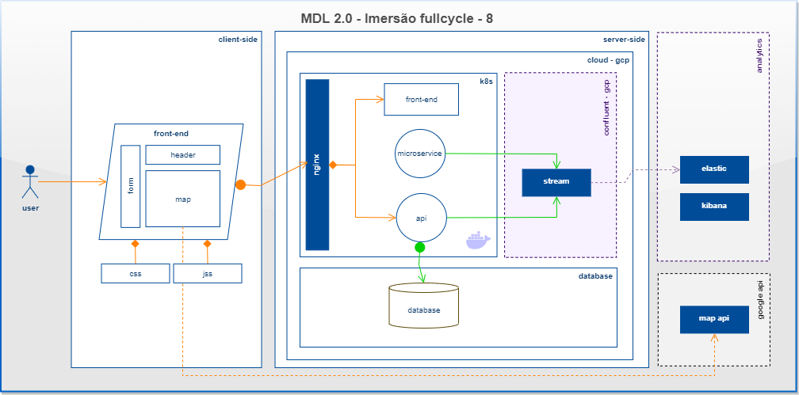

# Imersão Fullcycle 8 - Codelivery

## Sobre o repositório
Esse repositório contém todo código utilizado durante as aulas para referência.

Foi desenvolvido os seguintes projetos:

micro-service em Go para leitura de arquivo texto contendo as posições de cada entregador

api nodejs, com nestjs para consumir topico no kafka e disponibilizar as posições para o front-end reacts, através de socket.io

front-end com reactjs, utilizando materia-ui, socket.io e google maps

elasticserach e kibana para analise das entregas e posições dos entregadores

kubernetes na gcp com os seguintes manifestos: (deployment, configMap, service e ingress)

Mongodb como banco noSql para armazenar os dados dos entregadores
